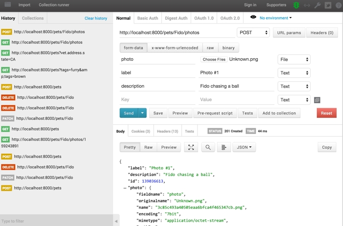

Swagger Express Middleware
============================


Sample 1 Walkthrough
--------------------------
* __Running the sample__
* [JavaScript Walkthrough](javascript.md)
* [YAML Walkthrough](yaml.md)


Overview
--------------------------
This sample demonstrates the most simplistic usage of Swagger Express Middleware. It simply creates a new Express Application and adds all of the Swagger middleware without changing any options, and without adding any custom middleware.

This sample also demonstrates a __fully-functional mock__ without any custom middleware or logic.


Run the Sample
--------------------------
To run the sample, you'll need to `cd` to the `samples` directory and then run [sample1.js](../../samples/sample1.js) in Node.  Here's how to do that:

````bash
cd node_modules/swagger-express-middleware/samples
node sample1.js
````


### Open Your Browser
You should see a message telling you that the Swagger Pet Store is now running at [http://localhost:8000](http://localhost:8000). Open that link in your web browser, and you should see the following page:


This page is just a simple GUI that lets you perform _some_ of the operations in the [Swagger Pet Store API](../../samples/PetStore.yaml).  You can add, edit, and delete pets, as well as add pet photos.  There's also helpful links to the raw YAML and JSON data.

__TIP:__ Browsers differ in how they handle .yaml and .json URLs.  Some browsers open the files as plain-text in the browser window.  Others prompt you to download the file or open it in your default text editor.


### Adding/Editing a Pet
The big text box in the middle of the page lets you enter the raw JSON data for a pet.  The `name` and `type` properties are required.  Everything else is optional.  Try adding a few pets, and then click the "_All Pets_" button to see all the persisted data.  Also try deleting some pets, and then click "_All Pets_" again to confirm that the pets were removed.

Each time you save or delete a pet, you'll see a pop-up window showing you the response from the server.  If there's something wrong with your JSON data, then you'll see an error message explaining the problem.  If all goes well, then the server will send the back the JSON data for the pet that was created, updated, or deleted.  This is _not necessarily_ the same as the JSON data you sent to the server, especially in the case of an update or delete.

__TIP:__ Swagger Express Middleware will automatically determine that the `name` property is the key field for a pet. That's how it determines whether the "_Save_" button causes an insert or an update.  It's also how it determines which pet to delete when you click the "_Delete_" button.  How does this work?  Read the [Mock middleware documentation](../middleware/mock.md).


### Adding/Viewing Photos
The form at the bottom of the page lets you add pet photos. Use the file-picker to select an image file on your computer, then add a friendly name and description of the image.  When you click "_Add Photo_", the photo will be saved for the current pet (based on the `name` property in the big text box above), and you will see a pop-up window showing you the response from the server.  Just like before, if there's something wrong with your data, then you'll see an error message; otherwise, you'll see the JSON data for your newly-saved photo.

You can click the "_Photos_" button to view all the photo data for the current pet.  This is _not_ the actual images, just the JSON data, such as file names, sizes, MIME types, etc.  However, you'll see that each image is assigned a unique `id` property.  You can use this ID to view an individual photo (e.g. [http://localhost:8000/pets/Fido/photos/123456789](http://localhost:8000/pets/Fido/photos/123456789))

__TIP:__ So how does each photo automatically get a unique ID assigned? The [Swagger Pet Store API](../../samples/PetStore.yaml) defines an optional, numeric `id` parameter for the `POST /pets/{petName}/photos` operation, and our HTML form didn't supply a value for that parameter.  The mock middleware determines that the `id` property is the key property, so it generates a unique value for it.  For more information, read the [Mock middleware documentation](../middleware/mock.md#how-primary-keys-are-determined).


### More Advanced Stuff
This HTML page is just a simple interface on top of the [Swagger Pet Store API](../../samples/PetStore.yaml), and there are several other operations in the API that aren't exposed on this page.  We encourage you to use a tool such as [Postman](http://www.getpostman.com) or [curl](http://curl.haxx.se) to further experiment with the API and try a few more advanced REST operations.

[](http://www.getpostman.com)


-------------------------------------------------------------------------------------------------
| &nbsp;                                        | Next: [JavaScript Walkthrough](javascript.md) |
|:----------------------------------------------|----------------------------------------------:|
