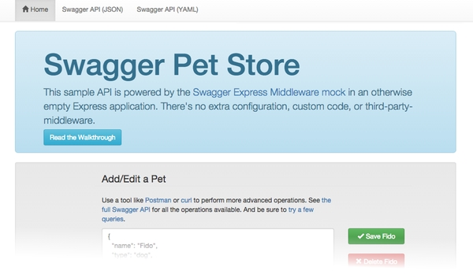

Swagger Express Middleware
===========================

Sample 2 Walkthrough
--------------------------
* [Adding Mock Data](walkthrough2.md#mock-data)
* [Customizing Options](walkthrough2.md#customizing-options)
* [Custom Middleware](walkthrough2.md#custom-middleware)


Overview
--------------------------
This sample expands upon [Sample 1 walkthrough](running.md) and demonstrates a few more advanced features of Swagger Express Middleware, such as setting a few options, initializing the mock data store, and adding custom middleware logic.


Running the Sample
--------------------------
Sample 2 uses the same [Swagger Pet Store API](../../samples/PetStore.yaml) as Sample 1.  Only the [JavaScript code](../../samples/sample2.js) is different.  Running the sample is the same as [running sample 1](running.md), except that you replace `node sample1.js` with `node sample2.js`.

Once you've got the sample running, browse to [http://localhost:8000](http://localhost:8000) and you should see the Swagger Pet Store homepage.  This is the same page as in Sample 1 ([index.html](../../samples/index.html)), although it behaves a bit differently now.  We'll got to that next...



#### Alernate Syntax
In Sample 1, we used the [createMiddleware](../exports/createMiddleware.md) function to load the Swagger file and initialize the middleware.

````javascript
// Call the createMiddleware function (aliased as "middleware")
middleware('PetStore.yaml', app, function(err, middleware) { 
````

The `createMiddleware` function is a helper function that simplifies your code a bit.  But in Sample 2, we're _not_ using it so we can show you what's going on under the hood.  When you call the `createMiddleware` function, it creates a new [Middleware](../exports/Middleware.md) object and calls its [`init()` method](../exports/Middleware.md#initswagger-callback).  That's exactly what we're doing in Sample 2:

````javascript
var middleware = new Middleware(app);
middleware.init('PetStore.yaml', function(err) { 
````

There is no functional difference between these two syntaxes.  It's just a matter of personal taste.


#### Pre-Populated Data
Sample 1 started out with an empty pet store, so you had to add a pet before [/pets](http://localhost:8000/pets) would return any data.  Now in Sample 2, we're using the [MemoryDataStore](../exports/MemoryDataStore.md) class to pre-populate the [Mock middleware](../middleware/mock.md) with data.

````javascript
// Create a custom data store with some initial mock data
var myDB = new MemoryDataStore();
myDB.save(
    new Resource('/pets/Lassie', {name: 'Lassie', type: 'dog', ...}),
    new Resource('/pets/Clifford', {name: 'Clifford', type: 'dog', ...}),
    new Resource('/pets/Garfield', {name: 'Garfield', type: 'cat', ...}),
    new Resource('/pets/Snoopy', {name: 'Snoopy', type: 'dog', ...}),
    new Resource('/pets/Hello%20Kitty', {name: 'Hello Kitty', type: 'cat', ...})
);

...

// The mock middleware will use our custom data store, 
// which we already pre-populated with mock data
app.use(middleware.mock(myDB));
````

Each of the five sample pets is a [Resource](../exports/Resource.md) object, which is what the [DataStore](../exports/DataStore.md) class uses to store data.  You could also load data using the [Resource.parse()](../exports/Resource.md#parsejson) method, which accepts plain JSON data and converts it to `Resource` objects.  Here's an example:

````javascript
var data = [
    {collection: '/pets', name: '/Lassie', data: {name: 'Lassie', type: 'dog'}},
    {collection: '/pets', name: '/Clifford', data: {name: 'Clifford', type: 'dog'}},
    {collection: '/pets', name: '/Garfield', data: {name: 'Garfield', type: 'cat'}},
    {collection: '/pets', name: '/Snoopy', data: {name: 'Snoopy', type: 'dog'}},
    {collection: '/pets', name: '/Hello%20Kitty', data: {name: 'Hello Kitty', type: 'cat'}}
];
    
var myDB = new MemoryDataStore();
myDB.save(Resource.parse(data));
````


#### Case-Sensitive and Strict Routing
By default Express is case-insensitive and is not strict about whether paths have a trailing slash, but in this sample, we've changed both of those settings using the [`app.set()` method](http://expressjs.com/4x/api.html#app.set).  

````javascript
app.enable('case sensitive routing');
app.enable('strict routing');
````

In Sample 1, [/pets/Fido](http://localhost:8000/pets/Fido), [/pets/fido](http://localhost:8000/pets/fido), and [/pets/Fido/](http://localhost:8000/pets/Fido/) all pointed to the same pet.  Now, those are treated as three different resources, and you could create a different pet at each one.  If you only create a pet named "_Fido_", then [/pets/fido](http://localhost:8000/pets/fido) and [/pets/Fido/](http://localhost:8000/pets/Fido/) will return HTTP 404 errors.

All Swagger Express Middleware modules honor Express's case-sensitivity and strict-routing settings.  This is why we passed the [Express App](http://expressjs.com/4x/api.html#app) to the `Middleware` constructor.  Every middleware module will automatically use the Express App (or [Router](http://expressjs.com/4x/api.html#router)) from the `Middleware` object.  But you can override this for any individual middleware if you want.  That's exactly what we've done in Sample 2 with the [Files middleware](../middleware/files.md):

````javascript
app.use(middleware.files(
    {
        caseSensitive: false,
        strict: false
    },
    ...
````

So, wheras all the _other_ middleware are case-sensitive and strict about trailing slashes, the Files middleware is the opposite.
